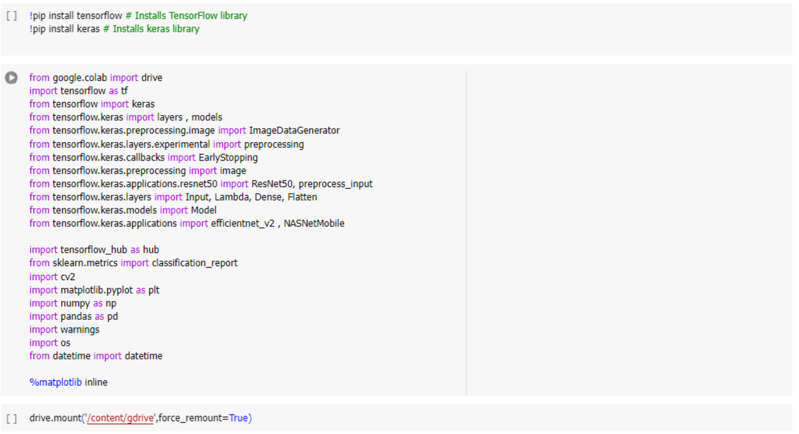
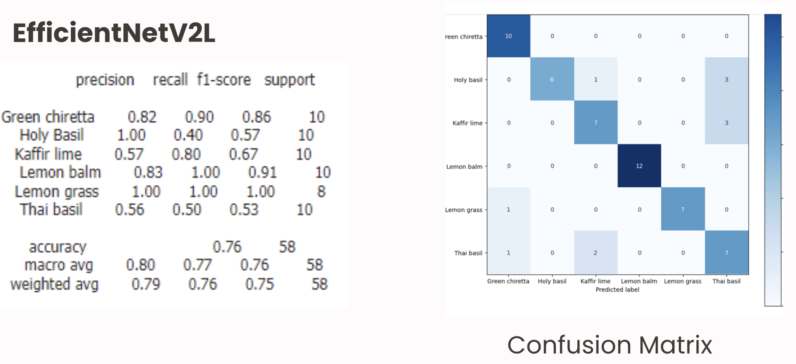
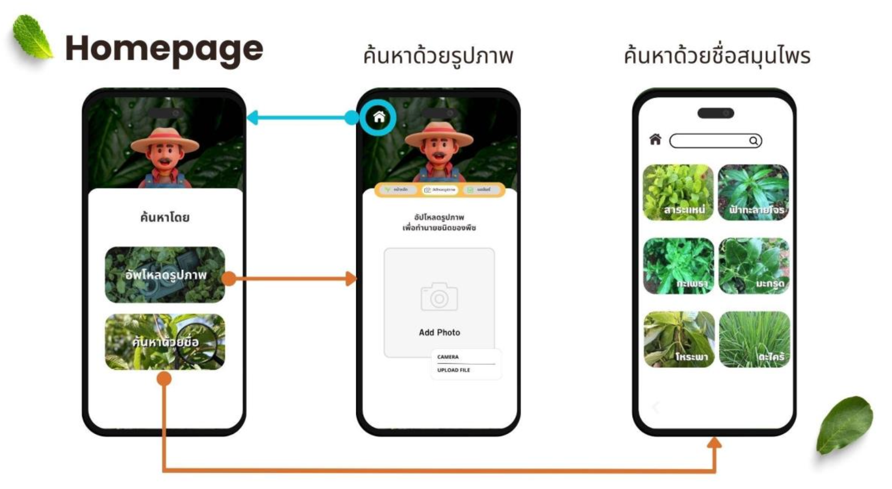

### AI For Agriculture

Google Colab: https://colab.research.google.com/drive/1s8MXo2iQ1XSTjU4gdhMlBj5AbZD0orRV?usp=sharing

This project was designed to develop an artificial intelligence (AI) system capable of accurately classifying and identifying types of Thai herbs with medicinal properties. The system applies image processing techniques on plant leaves, utilizing features such as shape, size, color, vein patterns, and texture, which vary among different herb species.

### Theories Used

**Object Detection**  
The process of detecting and identifying objects in images or videos within the field of computer vision. It utilizes Machine Learning and Deep Learning techniques to analyze visual data and extract information about objects.

**Image Processing**  
The application of Machine Learning models to analyze and process images. These models learn from large image datasets to extract features and insights from images, such as noise reduction using specialized models.

**Predict Image Classification**  
The task of predicting or automatically categorizing input images into predefined classes.

### Data Collection and Preparation  
Selecting appropriate data sources is crucial to ensure that the developed model is accurate and reliable. Therefore, the project team sought standardized and high-quality images of Thai herbs by selecting trusted websites or databases, such as Kaggle, which provides quality datasets covering the classification of Thai herbs. Additionally, the team captured supplementary images themselves to enrich the dataset.

### The data was divided into three parts as follows:  

1. **Training Data**: 70% of the total images for each type of herb were allocated for training the model.  
2. **Validation Data**: 20% of the total images for each type of herb were used for model validation.  
3. **Test Data**: 10% of the total images for each type of herb were reserved for testing the model.  

### Model Evaluation for the Best Analysis 
To evaluate the performance of the Deep Learning models, four architectures were selected and developed for the task of classifying herb leaf images. The chosen Deep Learning models and their architectures are as follows:  

1. **MobileNetV3Small**  
2. **ResNet-50**  
3. **EfficientNetV2L**  
4. **NasNetMobile**  

The models were developed using Google Colab with Python as the programming language. The libraries utilized for this task included TensorFlow and Keras.

### Model Performance Evaluation  

The performance of the models was assessed using a **Confusion Matrix**, which compares the actual class labels with the predicted class labels. This matrix provides statistical insights into the classification results.  

Additionally, the following metrics were calculated to evaluate the model's ability to distinguish between classes:  

1. **Precision**: Measures the proportion of true positive predictions out of all positive predictions made by the model.  
2. **Recall**: Measures the proportion of true positive predictions out of all actual positive instances in the dataset.  
3. **F1 Score**: The harmonic mean of precision and recall, providing a balanced metric that considers both false positives and false negatives.  
4. **Support**: refers to the number of true instances (actual occurrences) of each class in the dataset.

These metrics collectively help to assess the model's overall classification performance.

### Application UX/UI designed

---
